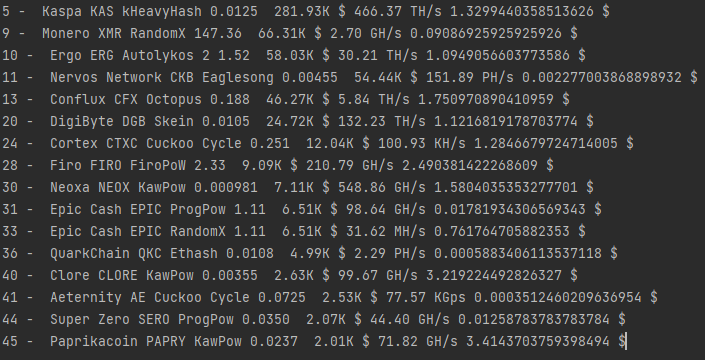
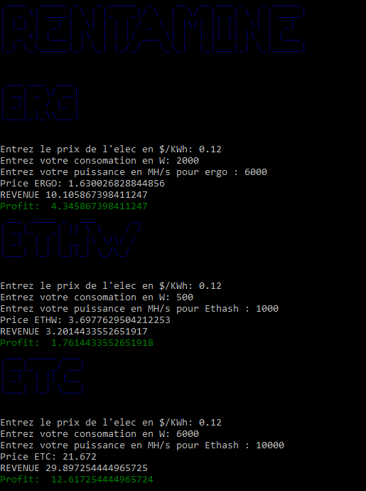

# RENTAMINE
Cost-effective software for cryptocurrency mining

RENTAMINE.py:
Scraping all data on miningpoolstats and selects algorithms for gpu.
Long to run, use RENTAMINE_OPTI.py much faster.

Sample output:

RENTAMINE_API.py:

Code working with APIs, much faster and more accurate (including power consumption, and price per KWh) but much less exotic corner.

Sample output:

